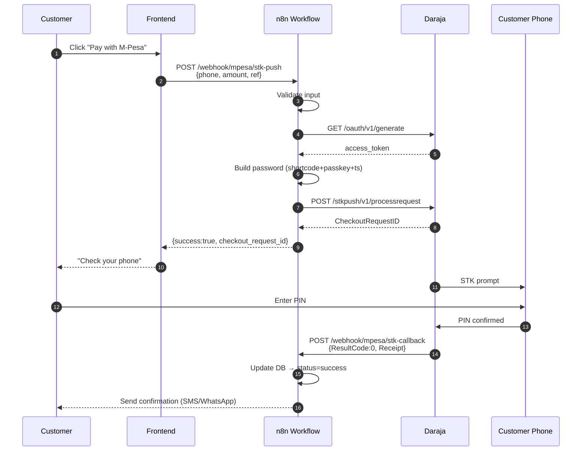
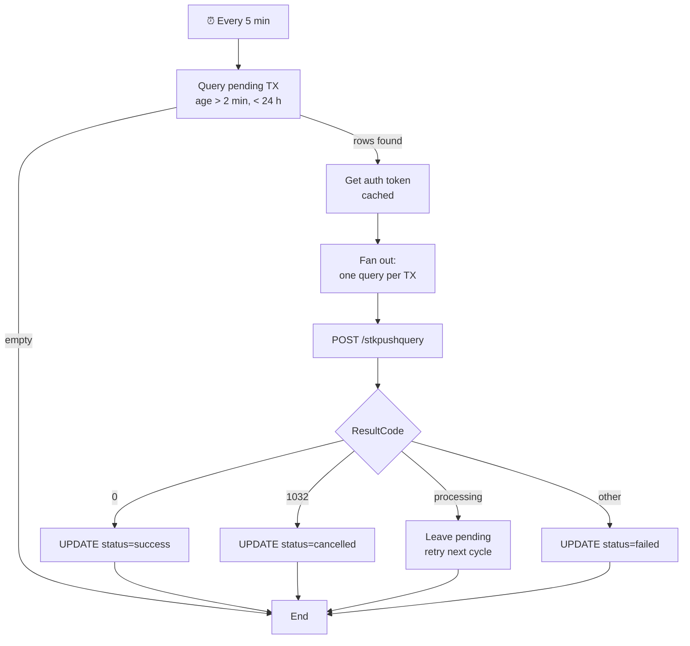

# Course Diagrams

Mermaid source files. GitHub renders them natively in Markdown. Export to PNG with `@mermaid-js/mermaid-cli` if you want to embed in slides / videos.

```bash
npm i -g @mermaid-js/mermaid-cli
mmdc -i stk-push-sequence.mmd -o stk-push-sequence.png -w 1920 -H 1080
```

## Files

| File | Used in | Description |
|---|---|---|
| `stk-push-sequence.mmd` | Module 2.1, Module 4 | End-to-end STK Push flow |
| `callback-flow.mmd` | Module 5.2 | Callback → DB update → confirmation |
| `reconciliation-flow.mmd` | Module 6.2 | Poll pending TX, resolve via `stkpushquery` |
| `architecture.mmd` | Module 7.1 | Production topology (Nginx, n8n, Postgres, Daraja) |
| `auth-caching.mmd` | Module 3.2 | Token cache hit/miss decision tree |

---

## Preview (rendered by GitHub)

### STK Push sequence



### Reconciliation flow



